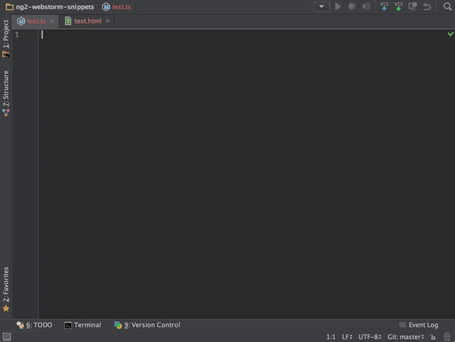
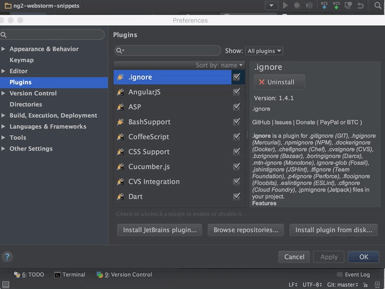
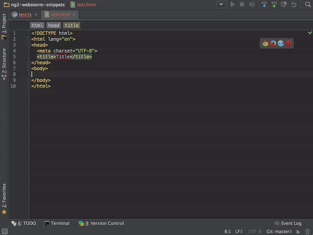

# Angular 2 TypeScript Live Templates (Snippets) for WebStorm

This script convert Angular 2 for TypeScript and HTML snippets from Visual Studio Code 
(Written by [John Papa](https://github.com/johnpapa/vscode-angular2-snippets)) to WebStorm Live Templates.



## Installing the templates

### From JetBrains Plugin repository

- Open IDE preferences `Cmd + ,`
- Go to `Plugins -> Browse repositories`
- Type `angular` and install `Angular 2 TypeScript Templates`
- Restart WebStorm



### By Copy xml file

- Clone repo or download [ng2-templates.xml](https://github.com/MrZaYaC/ng2-webstorm-snippets/blob/master/dist/ng2-templates.xml)
- Place the XML file in your [templates folder](https://www.jetbrains.com/webstorm/help/project-and-ide-settings.html)
: On OSX that would be ~/Library/Preferences/WebStorm{Version}/templates

- Restart WebStorm

## Usage
Type part of a snippet, press `enter`, and the snippet unfolds.

### TypeScript Angular Snippets
```typescript
a-component                 // component
a-component-root            // root app component
a-directive                 // directive
a-guard-can-activate        // CanActivate guard
a-guard-can-activate-child  // CanActivateChild guard
a-guard-can-deactivate      // CanDeactivate guard
a-guard-can-load            // CanLoad guard
a-http-get                  // http.get with Rx Observable
a-module                    // module
a-module-root               // root app module
a-module-routing            // routing module file (forChild)
a-output-event              // @Output event and emitter
a-pipe                      // pipe
a-route-path-404            // 404 route path
a-route-path-default        // default route path
a-route-path-eager          // eager route path
a-route-path-lazy           // lazy route path
a-service                   // service
a-service-http              // service with Http
a-ctor-skip-self            // angular ngmodule's skipself constructor
a-subscribe                 // Rx Observable subscription
```

### TypeScript RxJS Snippets
```typescript
rx-observable               // Rx Observable import
rx-subject                  // Rx Subject import
rx-replay-subject           // Rx ReplaySubject import
rx-behavior-subject         // Rx BehaviorSubject import
rx-add-operator             // Rx add operator import
rx-add-observable           // Rx add observable import
```

###HTML Snippets
```html
a-class                     // [class] binding
a-select                    // <select> control
a-style                     // [style] binding
a-ngClass                   // ngClass
a-ngFor                     // *ngFor
a-ngForAsync                // *ngFor with async
a-ngIf                      // *ngIf
a-ngIfElse                  // *ngIf with else
a-ngModel                   // ngModel
a-routerLink                // routerLink
a-routerLink-param          // routerLink with a route parameter
a-ngStyle                   // ngStyle
a-ngSwitch                  // ngSwitch
a-prej                      // pre debug | json
a-preja                     // pre debug | async | json
```

